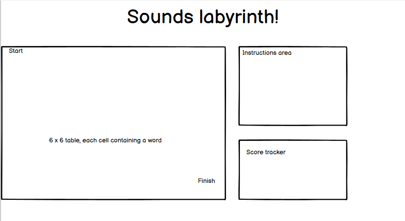

# Sounds labyrinth

Sounds labyrinth is a dynamic game,designed for students of English as a foreign language to practice their pronunciation. The basic premise of the game is to go from the start to the finish, clicking horizontally or vertically on a table cell that has the word with the target sound, in this case, the long 'e'. The pool of words, both correct and incorrect, will be randomly drawn from a pool at the game start to ensure an aspect of replayability. A score tracker will record correct and incorrect answers. It is targeted at both EFL students and EFL teachers.

## __UX__
* The site has been designed to be as minimalist as possible, with a stripped-down approach. Only what is required is displayed on the site. For many laptops, no scrolling will be required, and for smaller devices, the site is structured in such a way that the game area is separate and can be interacted with easily.
### __Colour Scheme__
* The colour scheme uses the background color of 'Cornsilk', which is neutral, and contrasts well with the black that is used for the fonts. When clicking on the cells of the grid, they will be coloured either red or green according to the answer that is input, which makes for a striking contrast to the simple base colours of the website.

### __Typography__
* The font used is [Zen Antique Soft](https://fonts.google.com/specimen/Zen+Antique+Soft). It was chosen for its simplicity, and professional look.

### __Wireframes__

index.html wireframe:

## __Features__

### __Existing Features__

__Instructions section__
  * A section that gives the basic details on how to play the game, with an example, and the method to initiate the game.

__Score area__
  * A section that keeps a tally of correct and incorrect answers.

__Table containing cells to be filled with words by Javascript__
  * A 6x6 table, with only 2 cells filled at the beginning indicating the start and the finish point. To begin with, no 'game' cells are visible; the first two will be revealed upon clicking 'Start'. Through javascript,when clicked, the cells will either be coloured red if an answer is incorrect, or green if correct. A correct answer has the additional effect of revealing more cells.

  __The modal__
  * A modal, which is to be called when either a right or wrong answer is clicked, and additionally upon ending the game. The message displayed therein will vary according to how it is called. The modal has a number of interesting features. For example, it is all white, and when called, the background is dimmed, thus making it easier to read. In addition, a user can click anywhere outside of the modal, and not on the 'X', to close it.

### __Features to be Implemented__

__A truly random maze path__
  * As it currently stands, the major drawback of the game is that the path from start to finish is predefined. Therefore, there is little to no replayability, despite the randomness of the words. Consequently, the most urgent feature to be implemented in the future should be a way to randomise the layout of the maze, to greatly magnify the replayability. I currently lack the coding knowledge to do this; however, this is something that I believe can be done.

__Create sound button__
  * An interesting option that I had considered when creating the site would be to create a button with a 'sound' icon that, when pressed, models the pronunciation of the word. There are also different ways that this could potentially be implemented. For example, for very low level learners, this could be a feature in the game at the start, to help them when choosing the word. However, for most learners, this would make the game too easy; instead, what might be preferable would be to have this feature enabled upon completing the game; that way, they would be able to focus on incorrect answers, or answers where they weren't sure, or were only able to get the right answer through deduction (i.e, they are certain that one of the words does not have the correct sound, therefore it must be the other, even if they are unsure of its pronunciation).

  __Create option for teachers to change the content of the cells__
  * The game as it is, being preconfigured to practice a very specific element of pronunciation, has a singular and narrow-minded scope from the point of view of both teacher and student. Despite this, with some adjustments, the site might be reconfigured in order to let a teacher change the scope. What if a teacher wanted to make his/her students practice a different part of pronunciation, for example words with silent letters, or homonyms vs minimal pairs? And why even limit the scope to pronunciation-what about vocabulary, spelling, or grammar? If a teacher were able to clear the arrays of correctWords and incorrectWords on lines 206 and 207, they would amplify the possible uses of this game (in conjunction with the first feature on this list, naturally!). Some code that would enable a teacher to then alter or disable the message of the modal accordingly, as well as the instructions and the title, could offer a vast amount of new possibilities for the game.

__Print option__
  * This game was designed to be played online, either with or without a teacher present. However, the vast majority of classes still take place face-to-face. With that in mind, the option to generate a labyrinth, with all of the cells filled in with words but not coloured in, which could then be easily exported as a pdf, would be an attractive one. This could then be printed and distributed to students.

__Reduce repetition of code in script.js__
  * Currently, the bulk of the game is coded between lines 5 and 185 of script.js. A lot of this code is very similar. As I improve my coding skills, I am sure I will find ways to condense this code and avoid having to copy and paste, and then change the element being called manually, which was a pain-staking and time-consuming process.

  ## __Technologies Used__
  * HTML was used to code the structure of the website, and CSS was used to style it. 
  * Balsamiq was used to create wireframes, to give a rough idea of how the website might look.
  *  The repository is hosted on GitHub, which allowed for version control.
  * Gitpod was the workspace used to code, and build the content of the website, which would then be committed to GitHub.
  * Git was used for version control.

## __Testing__

* All screenshots pertaining to browser compatibility, code validation and responsiveness can be found in a separate document, a link to which can be found [here](TESTING.md).

### Problems encountered

* One of the first problems I encountered while creating the code was how to draw objects from an array randomly, without there being any repeats. At this stage in my programming learning, I lack the knowledge of how to perform this myself; much searching on Google eventually led me to the stackoverflow forums, where I found someone who had been looking for the same solution as I had. I was able to use the code offered by a user (credited below), make some small adjustments, and suit it to my own needs.

* Another problem I ran into later on in the javascript was when creating a template literal for the checkAnswer function on line 233. I wanted the message to reuse the word that had been clicked on, i.e, if someone had clicked a cell with the word 'meat', this would be reproduced in the message. I was initially unable to produce the desired result, but with help from tutor support, I was pushed in the right direction to create a variable that would obtain the value using the keyword 'this'. I was also unsure as to whether the template literal should be placed inside the function, or separately, and was advised that it was better to make it a part of the same function.

### Unfixed Bugs

* To the best of my knowledge, no bugs exist in the website in its current state.

## Deployment

This project has been deployed to GitHub Pages.
From the repository, I went to the "Settings" tab and selected "Pages" from the sub-menu.
Once there, I selected the "main" branch from the dropdown, and then clicked the Save button.

The deployed site can be found [here](https://robn88.github.io/Sounds-labyrinth/).

### Local Deployment

If you would like to make a clone of this repository, you can type the following command in your IDE terminal:

- `git clone https://github.com/Robn88/Sounds-labyrinth.git`

Alternatively, if you are using Gitpod, you can simply click on the green Gitpod button at the top of the repository, and this will create a new workspace in your Gitpod account. [This link](https://gitpod.io/#https://github.com/Robn88/Sounds-labyrinth) will do the same thing for you if you do not see the green Gitpod button.

## Credits

### Content
* The score counter on lines 24-28 of index.html, and the javascript related to counting the scores on lines 254-267 of script.js, is taken from the love-maths walkthrough project, a link to which can be found [here](https://github.com/Robn88/love-maths).

* The getRandom function on lines 212 to 225 was adapted with only minor changes from code from the top answer on this page of [stackoverflow](https://stackoverflow.com/questions/50525909/random-item-from-array-with-no-repeat-using-javascript/50528028).

### Acknowledgements

* I would like to acknowledge the help provided to me by various people and websites, who have rendered the task of making this website easier, and in some cases, possible. In no particular order, I would like to thank:
   * w3schools.com, whose tutorials on HTML, CSS and JavaScript were a frequent reference for all matter of questions both large and small;
   * stackoverflow.com, whose forums provided me with many helpful answers to problems I was experiencing when writing my code, and indeed, provided an example of something I wasn't able to code but required for my project;
   * The Slack community of Code Institute, a consistent source of warmth and encouragement, especially when I felt I was hitting my head against a wall;
   * The Code Institute tutor system, who were able to gently push me into the right direction when I felt like I had expended my last reserves of patience on some issues;
   * My mentor Tim, whose guidance was always enlightening, criticism always firm but fair, and whose enthusiasm gave me much-needed self-belief;
  * All of my friends with English as a second language, who agreed to try the site, and provided valuable feedback;
  * Finally, to my current students, who tested the labyrinth and gave plenty of ideas as to how it might be improved.
