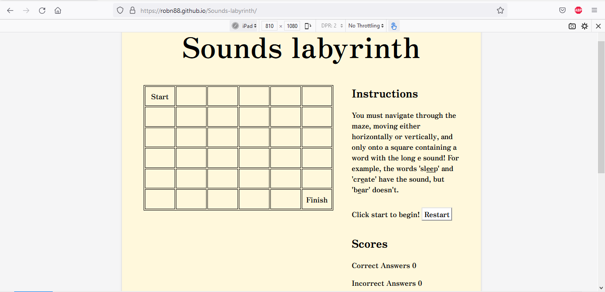

## __Testing__

### Browser Compatibility
* This site has been tested on three browsers for compatibility, as evidenced below:

Chrome laptop view:

Firefox, tablet view:

Microsoft Edge, mobile view:

### Code Validation

The code has passed through the code validators and no errors were found, as evidenced below:

CSS

index.html:

Javascript

### Responsiveness

* The website has been tested for responsiveness on a variety of devices, as evidenced below:

